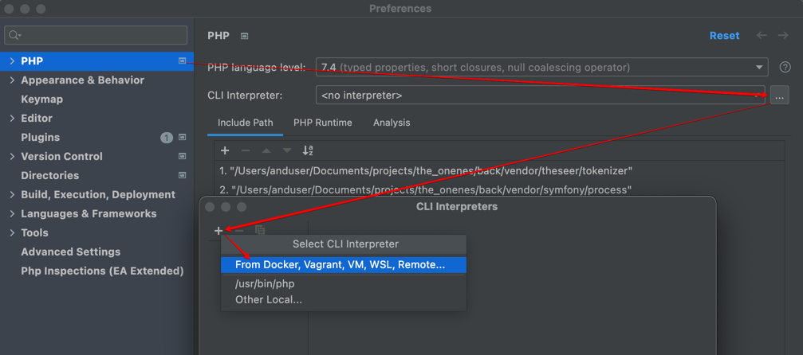
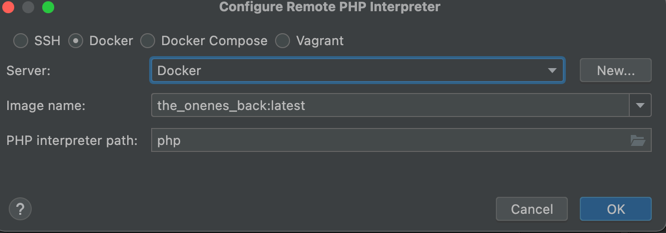
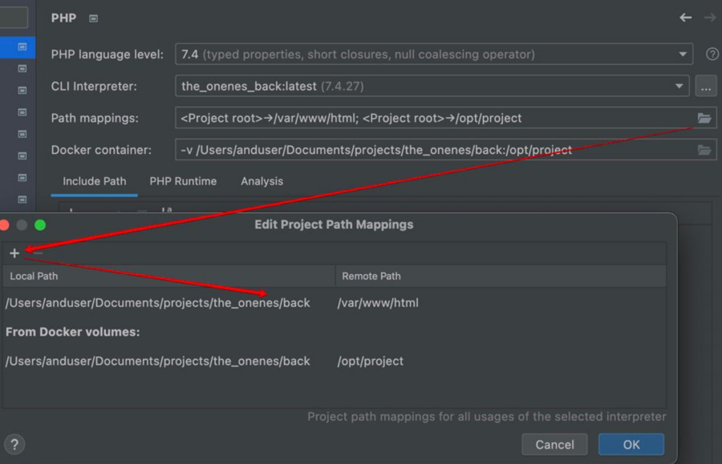
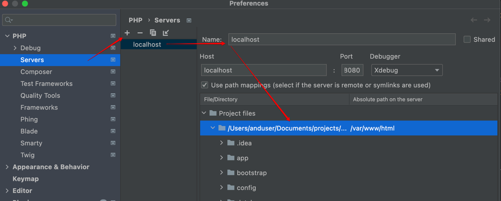

# Oneness

## Overview

- [Requirements](#requirements)
- [Installation](#installation)
- [Updating](#updating)
- [Xdebug](#setup-xdebug)
- [Additional files needed](#additional-files-needed)
- [Troubleshooting](#troubleshooting)

## Requirements

- [Docker](https://docs.docker.com/engine/install/ubuntu/)
- [Docker-compose](https://docs.docker.com/compose/install/)

## Installation

1. Clone backend & frontend repos in one dir

```
├── back
│   ├── config
│   │   ├── ... repo files
│   │   └── vhost.local
│   ├── ... repo files
│   └── Dockerfile.local
├── front
│   └── ... repo files
├── front.env
└── docker-compose.yml
```

2. Put `docker-compose.yml` into root directory
3. Run `docker-compose up -d` to build & up application
4. Build frontend

- Run `docker-compose run node bash` to pass into frontend container
- Inside container run `npm i` to install dependencies
- Inside container run `npm run build:prod` to compile frontend application

5. Build backend

- Run `docker-compose exec back bash` to pass into backend container
- Inside container run `composer install` to install dependencies
- Copy config file `cp .env.example .env`
- Inside container run `php artisan key:generate`
- Inside container run `php artisan migrate:fresh --seed`

6. Open [localhost](http://localhost) in your browser

## Updating

### Frontend

1. `cd front`
2. `git pull`
3. `cd ..`
4. `docker-compose run node sh`
5. Optional if package.json has been changed `npm i`
6. `npm run build:prod`

### Backend

- `cd back`
- `git pull`
- `cd ..`
- `docker-compose exec back sh`
- Optional if composer.json has been changed `composer install`
- `php artisan migrate`

##Setup xdebug
- Go to phpStorm preferences
- Add CLI interpretter



- Chose 'Docker' and image



- Add path mapping



- Add server with name 'localhost' and file mapping for backend directory '/var/www/html'



## Additional files needed

### docker-compose.yml

```yaml
version: '3.4'

networks:
    oneness-local:
        driver: bridge

services:
    back:
        environment:
            PHP_IDE_CONFIG: serverName=localhost
        build:
            context: back
            dockerfile: Dockerfile.local
            args:
                UID: ${UID:-1000}
                GID: ${GID:-1000}
        ports:
            - 8080:80
        user: www-data
        restart: on-failure
        working_dir: /var/www/html
        volumes:
            - ./back:/var/www/html
        networks:
            - oneness-local

    front:
        image: nginx:1.19.0-alpine
        ports:
            - ${WEB_PORT_HOST:-80}:80
        restart: on-failure
        working_dir: /usr/share/nginx/html
        volumes:
            - ./front/dist:/usr/share/nginx/html
            - ./front/nginxdefault.conf:/etc/nginx/conf.d/default.conf
        networks:
            - oneness-local

    node:
        image: node:12.18.4
        volumes:
            - ./front:/usr/share/nginx/html
            - ./front.env:/usr/share/nginx/html/.env.production
        working_dir: /usr/share/nginx/html
        env_file: front.env

    db:
        image: mysql:8.0
        restart: on-failure
        environment:
            MYSQL_DATABASE: tom
            MYSQL_USER: tom
            MYSQL_PASSWORD: fridayiminlove
            MYSQL_ROOT_PASSWORD: fridayiminlove
        volumes:
            - ./volumes/mysql:/var/lib/mysql
        ports:
            - ${DB_HOST_PORT:-3306}:3306
        networks:
            - oneness-local
```

### Dockerfile.local

```Dockerfile
FROM php:7.4-apache
COPY ./config/vhost.local /etc/apache2/sites-enabled/000-default.conf
RUN curl -sS https://getcomposer.org/installer | php -- --install-dir=/usr/local/bin --filename=composer \
&& apt-get update && apt-get install -y git libzip-dev unzip libpng-dev mysql-common default-mysql-client\
&& docker-php-ext-install zip pdo_mysql gd && a2enmod rewrite headers

RUN pecl install xdebug
RUN docker-php-ext-enable xdebug \
    && echo "xdebug.start_with_request=yes" >> /usr/local/etc/php/conf.d/docker-php-ext-xdebug.ini \
    && echo "xdebug.mode=debug" >> /usr/local/etc/php/conf.d/docker-php-ext-xdebug.ini \
    && echo "xdebug.client_host=host.docker.internal" >> /usr/local/etc/php/conf.d/docker-php-ext-xdebug.ini \
    && echo "xdebug.remote_enable=1" >> /usr/local/etc/php/conf.d/docker-php-ext-xdebug.ini \
    && echo "xdebug.client_port=9003" >> /usr/local/etc/php/conf.d/docker-php-ext-xdebug.ini

WORKDIR /var/www/html
```

### front.env

```dotenv
# DOMAIN
DOMAIN=http://localhost:8080
API_PREFIX=/api

PLATFORM_FEE=3

GUEST_GROW_BUSINESS_LINK=https://page.holistify.me/grow-your-business
CLIENT_GROW_BUSINESS_LINK=https://page.holistify.me/grow-your-business

STRIPE_KEY=

GOOGLE_CLIENT_ID=
GOOGLE_API_KEY=
G_CALENDAR_PREFIX=https://www.googleapis.com/calendar/v3
GOOGLE_DISCOVERY_DOCS = https://www.googleapis.com/discovery/v1/apis/calendar/v3/rest
GOOGLE_SCOPE=https://www.googleapis.com/auth/calendar https://www.googleapis.com/auth/calendar.events
```

### vhost.local

```
<VirtualHost *:80>
        DocumentRoot "/var/www/html/public"
        ErrorLog ${APACHE_LOG_DIR}/error.log
        CustomLog ${APACHE_LOG_DIR}/access.log combined
</VirtualHost>
```

## Troubleshooting

### Installation

#### Bind for 0.0.0.0:0000 failed: port is already allocated

- List already active containers with command `docker ps`
- Shut down containers with `docker-compose down` in another project folder
- Try to start application again

#### Permission denied on `composer install`

- Create folder `back/vendor` from host context
- Grant full permissions on folders
    - `chmod -R 777 back/bootstrap`
    - `chmod -R 777 back/vendor`
    - `chmod -R 777 back/storage`
